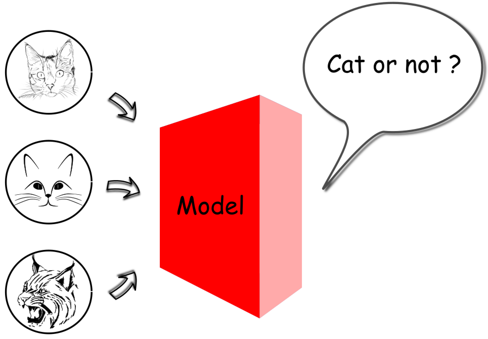

[TOC]

### 定义

和普通计算机程序不同的是，机器学习可以根据新的输入来调整自身的行为，但实际上是这种没有人为干预的适应给人的错觉。

**那么什么是机器学习模型？**

> 机器学习算法是揭示数据中潜在关系的过程。 
>
> **机器学习模型（machine learning model）**是机器学习算法产出的结果，可以将其看作是在给定输入情况下、输出一定结果的`函数（function）` \mathtt{F}F。
>
> 机器学习模型不是预先定义好的固定函数，而是从历史数据中推导出来的。因此，当输入不同的数据时，机器学习算法的输出会发生变化，即机器学习模型发生改变。

在图像识别的场景中，可以训练机器学习模型来识别照片中的对象。 

 

> 机器学习的任务，就是从广阔的映射空间中**学习**函数。

在这种情况下，找出数百万像素和 “是/否” 答案之间的潜在映射关系的过程，就是我们所说的**机器学习**。

#### 有监督VS无监督

