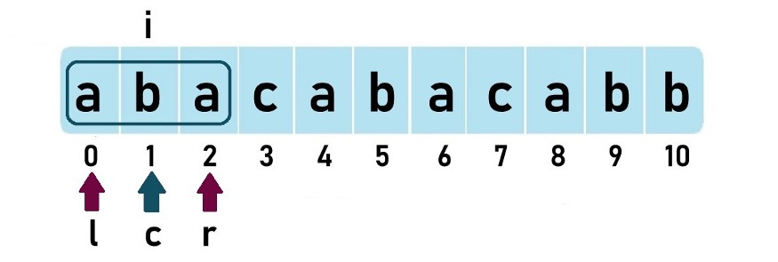
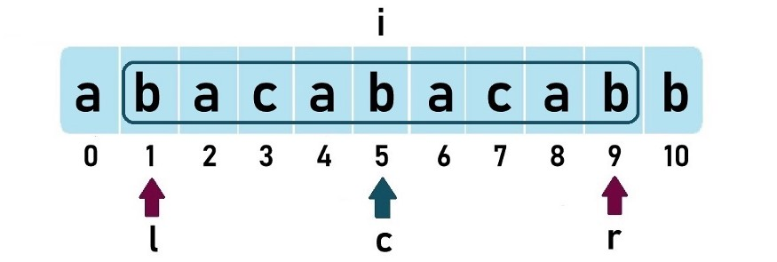
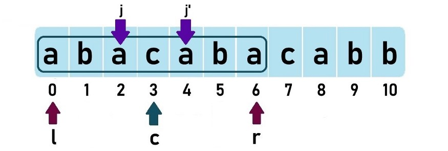
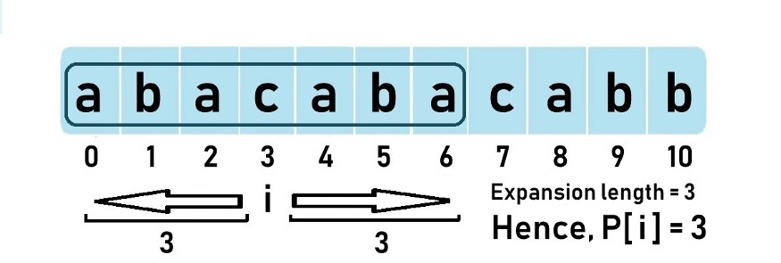

### Manacher Algorithm and Longest Palindrome

Today's topic is about how to find longest palindrome in O(n) time complexity. Thus, let's look at manacher algorithm.

It adopts the idea of dynamic programming(I think).

Eg: “abacabacabb” 

When going through from left to right, when i is at index 1, the longest palindromic substring is "aba"(length=3)

 

The anwser for the given string is 9 when the palindrom is centered at index 5; c,l,r are as follows:



And then let's talk about a new concept/term called mirror index.For palindrome "abacaba", the mirror of j is j' and the mirror of j' is j.



Now, come back to the algorithm. When we move i from left to right, we try to “**expand**” the palindrome **at each i**. When I say the word expand, it means that I’ll check whether there exists a palindrome centered at i and if there exists one, I’ll store the “**expansion length**” to the left or to the right in a new array called **P[] array** or (some prefer) **LPS[]**. 

**If the palindrome at i expands beuond the current right boundary r,then c is updated to i and new l,r are found and updated.**

Example time. Let’s take the previously discussed palindrome “abacaba” which is centered at i = 3. 



Below are two most important points:

* **As long as the palindrome at index i’ does NOT expand beyond the left boundary (l) of the current longest palindrome, we can say that the minimum certainly possible expansion length at i is P[i’].** 
* **Now, if the palindrome at index i’ expands beyond the left boundary (l) of the current longest palindrome, we can say that the minimum certainly possible expansion length at i is r-i.** 

In summary, we need to find the possible minimum length that are already verified to be  the same. If the mirro index i' doesn't expand out of the current boundaty, so the value is P[i].

But what if i' exceeds left boundary of the current center? Target value must be r-i, why not P[i']? Because if it is ,the current palindrome will be longer.

So what we need to do is:

1. Go through from left to right, log P[i] choose the minimum of P[i'] and r - i.
2. If i + P[i] > r, update c and r ,remember to create a var name maxlen to log the longest length and a according center pos.
3. To make all the target string with an odd length, preprocess the string ,add "#".
4. locate the original center index and use substring function to return the anwser.

Here we give the solution to leetcode problem number 5's solution in Java

```java
class Solution {
    public String longestPalindrome(String s) {
        int N = s.length();
        String str = getModifiedString(s,N);
        int len = 2 * N + 1;
        int[] P = new int[len];
        int c = 0,center = 0,maxlen = 0,r = 0;
        for(int i = 0;i<len;++i){
            int mirro = 2 * c - i;
            if(i<r){
                P[i] = Math.min(r-i,P[mirro]);
            }
            int a = i + P[i] + 1;
            int b = i - P[i] -1;
            while(a<len&&b>=0&&str.charAt(a)==str.charAt(b)){
                ++a;--b;++P[i];
            }
            //calculate max
            if(i+P[i]>r){
                c = i;
                r = i + P[i];
            }
            if(P[i]>maxlen){
                center = i;
                maxlen = P[i];
            }
        }
        int lb = center/2 -maxlen/2,rb = center/2 + maxlen/2;
        if(str.charAt(center)!='#')++rb;
        return s.substring(lb,rb);
    }
    String getModifiedString(String s,int N){
        StringBuilder sb = new StringBuilder();
        for(int i = 0;i<N;++i){
            sb.append("#");
            sb.append(s.charAt(i));
        }
        sb.append("#");
        return sb.toString();
    }
}
```

Thus ends, have a good mood.